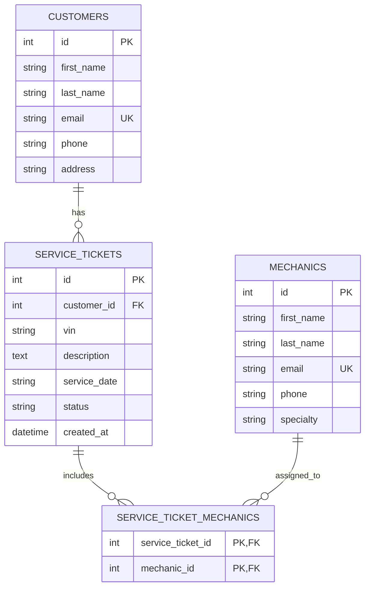

# Entity Relationship Diagram

This ERD represents the SQLAlchemy models in `app/models.py`.

## Relationships

- One customer can have many service tickets.
- Each service ticket belongs to one customer.
- One service ticket can have many mechanics.
- One mechanic can be assigned to many service tickets.
- The `service_ticket_mechanics` table connects mechanics and service tickets with a many-to-many relationship.
